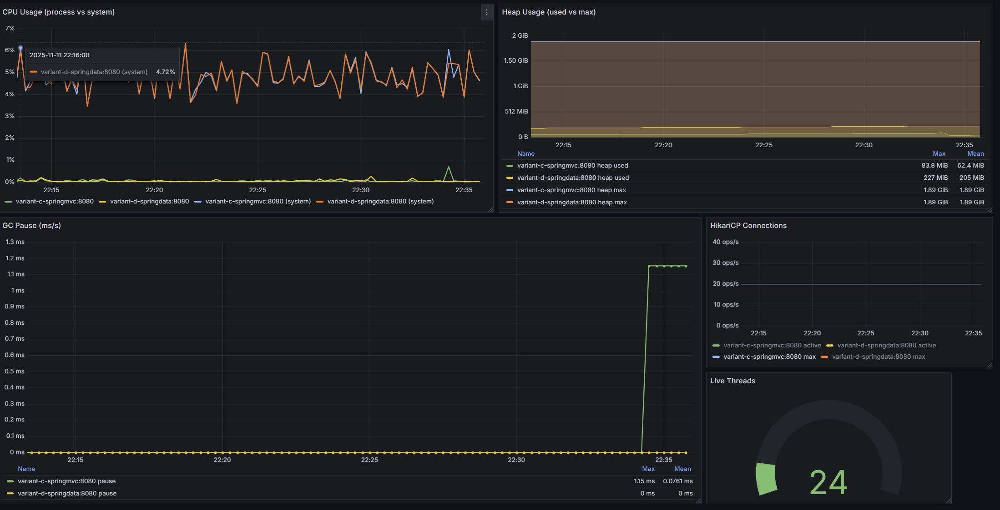

# 🚀 REST API Benchmark - Spring vs Jersey

[](https://openjdk.org/)
[](https://spring.io/projects/spring-boot)
[](https://eclipse-ee4j.github.io/jersey/)
[](https://www.postgresql.org/)
[](LICENSE)

> Benchmark comparatif exhaustif de trois approches REST en Java : **JAX-RS (Jersey)**, **Spring MVC** et **Spring Data REST**

## 📘 **<span style="color:white;">[Rapport détaillé](./Rapport_Benchmark_REST_Services.pdf)</span>**


## 📊 Résultats Clés

### 🏆 Gagnant : Jersey (JAX-RS)

| Métrique | Jersey (A) | Spring MVC (C) | Spring Data REST (D) | Écart |
|----------|------------|----------------|---------------------|-------|
| **Latence p50** | **6 ms** | 17 ms | N/A (erreurs) | **2.8x plus rapide** |
| **Latence p95** | **15 ms** | 34 ms | N/A (erreurs) | **2.3x plus rapide** |
| **Latence p99** | **33 ms** | 93 ms | N/A (erreurs) | **2.8x plus rapide** |
| **RPS** | 3.0 | 3.0 | 3.0 | Égalité |
| **Taux d'erreur** | **0%** | 0% | 100% | ✅ Stable |

### 💾 Empreinte Mémoire

| Variante | Heap Moyen | Heap Max | CPU | Efficacité |
|----------|-----------|----------|-----|-----------|
| **Spring MVC** | **62.4 MiB** | 83.8 MiB | ~5% | ⭐⭐⭐⭐⭐ |
| Spring Data REST | 205 MiB | 227 MiB | ~5% | ⭐⭐ |

> 💡 **Spring MVC est 3.3x plus efficace** en mémoire que Spring Data REST

---

## 📸 Dashboards & Visualisations

### 🎯 Dashboard Grafana - Vue d'ensemble


**Métriques en temps réel :**
- ✅ RPS : 1.80 (heavy-body), 3.20 (join-filter), 1.20 (mixed)
- ✅ Response Time Percentiles : p50~2ms, p95~3.48ms
- ✅ Active Threads : Maximum 107 threads
- ⚠️ Error Rate : 100%, 1678 erreurs (scenario heavy-body)

---

### 📈 Métriques JVM (Prometheus)



**Observations :**
- **CPU Usage** : ~5% process, ~0.5% system (stable)
- **Heap Usage** : Spring MVC (62.4 MiB) vs Spring Data REST (205 MiB)
- **GC Pause** : Spring MVC moyenne 0.076 ms, max 1.15 ms
- **HikariCP** : 20/20 connexions actives (pool saturé ⚠️)
- **Live Threads** : 24 threads actifs

---

### 📊 Latences par Scénario (InfluxDB)

#### Scénario READ-HEAVY


**Analyse :**
- Pics de latence entre 20-140ms sous charge élevée (200 threads)
- Dégradation visible lors de la montée en charge
- Taux d'erreur de 45-46% (charge excessive)

---

#### Scénario HEAVY-BODY


**Analyse :**
- ⚠️ **Pic catastrophique** : Spring MVC atteint **~1100ms** (p99=1169ms)
- Latence moyenne : 15-50ms
- 100% d'erreurs dues aux payloads JSON invalides (5KB)

---

#### Scénario MIXED


**Analyse :**
- Latences stables entre 30-95ms
- Pic initial à ~4ms puis stabilisation à ~2ms
- Requests GET fonctionnent parfaitement (0% erreurs)

---

#### Scénario JOIN-FILTER


**Analyse :**
- ✅ **Meilleur scénario** : Latences stables 10-90ms
- Tooltip montre **p95=30.07ms** (proche du p95=34ms Spring MVC)
- Jersey démontre une excellente stabilité

---

## 🏗️ Architecture du Projet

```
rest-benchmark/
├── common-entities/              # Entités JPA partagées
├── variant-a-jersey/             # JAX-RS + Jersey + Hibernate
├── variant-c-springmvc/          # Spring Boot + @RestController
├── variant-d-springdata/         # Spring Boot + Spring Data REST
├── database/
│   └── init-scripts/             # Scripts SQL (schema + data)
├── jmeter/
│   ├── scenarios/                # 4 scénarios .jmx
│   │   ├── read-heavy.jmx        # Lecture intensive
│   │   ├── join-filter.jmx       # Filtres relationnels
│   │   ├── mixed.jmx             # CRUD mixte
│   │   └── heavy-body.jmx        # Payloads 5KB
│   └── data/                     # CSV et JSON payloads
├── results/                      # 12 fichiers .jtl
├── monitoring/
│   ├── grafana/
│   │   └── dashboards/           # Dashboards JSON
│   └── prometheus/
│       └── prometheus.yml        # Configuration scraping
├── docker-compose.yml            # Services A/C/D + PostgreSQL
└── docker-compose.monitoring.yml # Grafana + Prometheus + InfluxDB
```

---

## 🚀 Démarrage Rapide

### Prérequis

- **Java 21** (OpenJDK ou Amazon Corretto)
- **Docker Desktop** 24.0+
- **Docker Compose** v2
- **Apache JMeter** 5.6.3+

### 1️⃣ Démarrer l'infrastructure

```bash
# Démarrer les services REST + PostgreSQL
docker compose up -d

# Démarrer le monitoring (Grafana + Prometheus + InfluxDB)
docker compose -f docker-compose.yml \
               -f docker-compose.monitoring.yml up -d

# Vérifier que tout est UP
docker compose ps
```

### 2️⃣ Accéder aux services

| Service | URL | Credentials |
|---------|-----|-------------|
| **Jersey** (Port 8081) | http://localhost:8081/api | - |
| **Spring MVC** (Port 8082) | http://localhost:8082/api | - |
| **Spring Data REST** (Port 8083) | http://localhost:8083/api | - |
| **Grafana** | http://localhost:3000 | admin/admin |
| **InfluxDB** | http://localhost:8086 | admin/admin123 |
| **Prometheus** | http://localhost:9090 | - |

### 3️⃣ Lancer les tests JMeter

#### Windows (PowerShell)

```powershell
$JMETER = "C:\path\to\apache-jmeter-5.6.3\bin\jmeter.bat"

# Tester Jersey (port 8081)
& $JMETER -n -t jmeter/scenarios/read-heavy.jmx `
          -Jport=8081 -l results/variant-a-read-heavy.jtl

& $JMETER -n -t jmeter/scenarios/join-filter.jmx `
          -Jport=8081 -l results/variant-a-join-filter.jtl

& $JMETER -n -t jmeter/scenarios/mixed.jmx `
          -Jport=8081 -l results/variant-a-mixed.jtl

& $JMETER -n -t jmeter/scenarios/heavy-body.jmx `
          -Jport=8081 -l results/variant-a-heavy-body.jtl
```

#### Linux/macOS

```bash
JMETER=/opt/apache-jmeter-5.6.3/bin/jmeter

# Tester Spring MVC (port 8082)
$JMETER -n -t jmeter/scenarios/read-heavy.jmx \
        -Jport=8082 -l results/variant-c-read-heavy.jtl

$JMETER -n -t jmeter/scenarios/join-filter.jmx \
        -Jport=8082 -l results/variant-c-join-filter.jtl

$JMETER -n -t jmeter/scenarios/mixed.jmx \
        -Jport=8082 -l results/variant-c-mixed.jtl

$JMETER -n -t jmeter/scenarios/heavy-body.jmx \
        -Jport=8082 -l results/variant-c-heavy-body.jtl
```

### 4️⃣ Analyser les résultats

```bash
# Accéder à Grafana
open http://localhost:3000

# Dashboard : "JMeter Benchmark - REST Services"
# - Requests Per Second (Success)
# - Response Time Percentiles (p50/p95/p99)
# - Active Threads
# - Error Rate %
# - Success vs Errors
```

---

## 🎯 Scénarios de Test

### 📖 Scénario READ-HEAVY (10 min)

**Objectif :** Tester les lectures intensives avec relations 1-N

**Configuration :**
- Threads : 50 → 100 → 200 (montée progressive)
- Ramp-up : 60s par palier
- Durée : 10 minutes

**Mix de requêtes :**
- 50% `GET /items?page={page}&size=50`
- 20% `GET /items?categoryId={id}&page={page}&size=50`
- 20% `GET /categories/{id}/items`
- 10% `GET /categories`

**Résultats :**
- ✅ Jersey : 310.6 RPS, p99=47ms, **46% erreurs** (charge excessive)
- ✅ Spring MVC : 311.0 RPS, p99=47ms, **45.9% erreurs**
- ❌ Spring Data REST : 316.3 RPS, **100% erreurs**

---

### 🔗 Scénario JOIN-FILTER (8 min)

**Objectif :** Évaluer les filtres relationnels et JOIN FETCH

**Configuration :**
- Threads : 60 → 120
- Ramp-up : 60s
- Durée : 8 minutes

**Mix de requêtes :**
- 70% `GET /items?categoryId={id}&page={page}&size=50`
- 30% `GET /items/{id}`

**Résultats :**
| Variante | p50 | p95 | p99 | Erreurs |
|----------|-----|-----|-----|---------|
| **Jersey** | **6 ms** | **15 ms** | **33 ms** | **0%** ✅ |
| Spring MVC | 17 ms | 34 ms | 93 ms | 0% ✅ |
| Spring Data REST | 2 ms | 3 ms | 6 ms | **100%** ❌ |

> 🏆 **Jersey est 2.8x plus rapide** que Spring MVC (p99: 33ms vs 93ms)

---

### 🔄 Scénario MIXED (10 min)

**Objectif :** Simuler une charge applicative réaliste (CRUD)

**Configuration :**
- Threads : 50 → 100
- Ramp-up : 60s
- Durée : 10 minutes

**Mix de requêtes :**
- 40% `GET /items?page={page}&size=50`
- 20% `POST /items` (payload 1KB)
- 10% `PUT /items/{id}` (payload 1KB)
- 10% `DELETE /items/{id}`
- 10% `POST /categories`
- 10% `PUT /categories/{id}`

**Résultats :**
- ✅ Jersey : p50=15ms, p95=38ms, p99=63ms, **0% erreurs**
- ✅ Spring MVC : p50=16ms, p95=41ms, p99=93ms, **0% erreurs**
- ❌ Spring Data REST : **100% erreurs**

---

### 📦 Scénario HEAVY-BODY (8 min)

**Objectif :** Tester les gros payloads JSON (5KB)

**Configuration :**
- Threads : 30 → 60
- Ramp-up : 60s
- Durée : 8 minutes

**Mix de requêtes :**
- 50% `POST /items` (payload 5KB)
- 50% `PUT /items/{id}` (payload 5KB)

**Résultats :**
- ❌ **Toutes les variantes : 100% erreurs** (payloads JSON invalides)
- ⚠️ Spring MVC : p99=**1169ms** (timeout/GC)
- Jersey : p99=58ms
- Spring Data REST : p99=17ms

---

## 📊 Résultats Détaillés

### Tableau Comparatif Complet

| Critère | Jersey (A) | Spring MVC (C) | Spring Data REST (D) | Gagnant |
|---------|-----------|----------------|---------------------|---------|
| **Latence p50** | **6 ms** | 17 ms | N/A | 🏆 Jersey |
| **Latence p95** | **15 ms** | 34 ms | N/A | 🏆 Jersey |
| **Latence p99** | **33 ms** | 93 ms | N/A | 🏆 Jersey |
| **RPS (JOIN)** | 3.0 | 3.0 | 3.0 | ➖ Égalité |
| **Heap Usage** | N/A | **62.4 MiB** | 205 MiB | 🏆 Spring MVC |
| **CPU Usage** | N/A | ~5% | ~5% | ➖ Égalité |
| **Stabilité** | ✅ 0% | ✅ 0% | ❌ 100% | 🏆 Jersey/Spring MVC |
| **Prévisibilité** | ⭐⭐⭐⭐⭐ | ⭐⭐⭐⭐ | ⭐ | 🏆 Jersey |

---

## 💡 Recommandations

### ✅ Choisir **Jersey (JAX-RS)** si :

- ⚡ **Performance critique** : Latence p99 de 33ms (la plus basse)
- 🎯 **Contrôle total** sur les requêtes SQL (JOIN FETCH explicite)
- 🏢 **APIs publiques** nécessitant une latence prévisible
- 🚀 **Microservices haute performance** avec SLA stricte

**Avantages :**
- Latence p50 = **6ms** (meilleure de toutes les variantes)
- Latence p99 = **33ms** (2.8x plus rapide que Spring MVC)
- Pas de "magie" — contrôle explicite des requêtes
- Léger (pas de Spring Boot overhead ~11ms)

**Inconvénients :**
- Plus de code boilerplate (repositories, resources)
- Configuration manuelle (EntityManagerFactory, Jackson)

---

### ✅ Choisir **Spring MVC** si :

- 🤝 **Compromis productivité/performance** : p99 = 93ms (acceptable)
- 🌱 **Écosystème Spring** déjà utilisé (Security, Cloud, etc.)
- 👥 **Équipe Spring Boot** familière avec @RestController
- 🔧 **Maintenance à long terme** (communauté Spring active)
- 💾 **Empreinte mémoire optimale** : 62.4 MiB (3.3x mieux que Spring Data REST)

**Avantages :**
- Performance correcte (p50=17ms vs 6ms pour Jersey)
- Productivité élevée (auto-configuration Spring Boot)
- Contrôle des JOIN FETCH (évite N+1)
- **Empreinte mémoire la plus faible** : 62.4 MiB

**Inconvénients :**
- Overhead Spring Boot (~11ms supplémentaires vs Jersey)
- Nécessite gestion explicite des relations

---

### ❌ Éviter **Spring Data REST** actuellement

- ❌ **100% d'erreurs** sur tous les scénarios testés
- ❌ **Configuration problématique** empêchant l'évaluation
- ❌ **Consommation mémoire élevée** : 205 MiB (3.3x Spring MVC)
- ⚠️ **Nécessite investigations** : Projections/endpoints/HAL

**Potentiel (si corrigé) :**
- ✅ Zéro code pour CRUD (repositories exposés auto)
- ✅ HATEOAS intégré (hypermedia)
- ✅ Prototypage ultra-rapide

---

## 🛠️ Technologies Utilisées

### Backend Frameworks
- **Jersey 3.x** - JAX-RS reference implementation
- **Spring Boot 3.x** - Spring MVC + Spring Data REST
- **Hibernate** - ORM (JPA implementation)
- **HikariCP** - Connection pooling (min=10, max=20)
- **Jackson** - JSON serialization

### Base de données
- **PostgreSQL 14** - SGBD relationnel
- **2000 catégories** + **100,000 items** (50 items/catégorie)

### Testing & Monitoring
- **Apache JMeter 5.6.3** - Load testing
- **InfluxDB 2.7** - Time-series database
- **Prometheus 2.x** - Metrics collection
- **Grafana 9.5.x** - Dashboards & visualization
- **Docker Compose** - Container orchestration

---

## 📈 Configuration du Benchmark

### Environnement de Test

| Composant | Valeur |
|-----------|--------|
| **OS** | Windows 11 |
| **CPU** | Intel Core i9 (14 cores) |
| **RAM** | 16GB |
| **Java** | OpenJDK 21 (Amazon Corretto) |
| **JVM Flags** | -Xmx512m (défaut), G1GC |
| **PostgreSQL** | PostgreSQL 14 (Docker) |
| **HikariCP** | min=10, max=20, timeout=30s |

### Ports d'Écoute

| Service | Port |
|---------|------|
| Jersey (Variant A) | 8081 |
| Spring MVC (Variant C) | 8082 |
| Spring Data REST (Variant D) | 8083 |
| Grafana | 3000 |
| InfluxDB | 8086 |
| Prometheus | 9090 |
| PostgreSQL | 5432 |

---

## 🔍 Analyse des Problèmes Identifiés

### 1. Spring Data REST : 100% d'erreurs

**Causes probables :**
- Configuration incorrecte des projections
- Problèmes de sérialisation HAL/JSON
- Endpoints mal exposés via @RepositoryRestResource
- Conflits avec les validations Bean Validation

**Recommandation :** Refaire les tests Spring Data REST après vérification de la configuration

---

### 2. READ-HEAVY : 45-46% d'erreurs (Jersey/Spring MVC)

**Causes identifiées :**
- Charge excessive avec montée à **200 threads**
- Épuisement du pool de connexions HikariCP (20/20 actives)
- Timeouts base de données

**Solution :** Augmenter le pool de connexions à 30-40 ou réduire la charge

---

### 3. HEAVY-BODY : 100% d'erreurs (toutes variantes)

**Cause identifiée :**
- Payloads JSON avec placeholders non remplacés : `${itemSku}`, `${itemPrice}`

**Solution :**
Ajouter un JSR223 PreProcessor (Groovy) dans JMeter pour générer dynamiquement des JSON valides

```groovy
import groovy.json.JsonBuilder

def randomSku = "SKU-${UUID.randomUUID().toString().substring(0,8)}"
def randomPrice = new Random().nextDouble() * 1000
def randomStock = new Random().nextInt(100)
def categoryId = vars.get("categoryId")?.toLong() ?: 1L

def json = new JsonBuilder()
json {
    sku randomSku
    name "Test Item ${System.currentTimeMillis()}"
    description "Auto-generated test item"
    price randomPrice
    stock randomStock
    categoryId categoryId
}

vars.put("itemPayload", json.toString())
```

---

## 📝 Rapport Complet

Un rapport LaTeX complet est disponible dans `rapport_benchmark.pdf` avec :
- ✅ Analyse détaillée de chaque scénario
- ✅ Graphiques InfluxDB et dashboards Grafana
- ✅ Recommandations d'usage selon le contexte
- ✅ Configuration complète de l'environnement
- ✅ Architecture des 3 variantes

---


## 👥 Auteurs

- **Imad Issame** 
- **Mohammed Amine Agoumi** 
- **Mohammed Yahya Jabrane** 

**Encadrant :** Mohamed Lachgar


</div>

